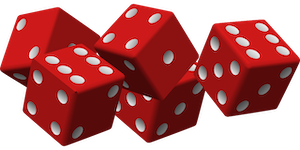

# MVC-PROJECT

### Documentation for repo mvc-project by mack20.  
A project to examinate the course mvc at BTH. 

## Yatzy

Play Yatzy, and try to make it to the High Score!  

Results of the Yatzy-games are saved in a database and presented under statistics, 
where you can find statistics about the last ten games played!

### How to play?

Instructions are presented when the user is attempting to start a new game. 

The Yatzy is played with five dices. The game consists of thirteen rounds, after all rounds the result is presented. 
The user rolls the dices a maxium of three rolls per round. The aim is to get as high a score as possible. 
To get the bonus of 50 additional points the user must get 63 points or more from the first six rounds (Aces to Sixes).  
If the user rolls five dices with the same faces you get Yatzy, also worth 50 points. 

The user is presented with a button to roll the first hand of dices. 
When rolled, the five dices are presented with a checkbox for each die. 
To the users left the scorebox is presented. 

The user shall select dices to keep, non selected dices will be rerolled.

The user shall choose where to put score into scorebox after a maximum of three rolls.
When dices are added to scorebox the accumaluted score for that round is presented and the user rolls a new hand. 
When all cells in the scorebox is filled, the result is presented to the user. 
If the user acchieved a new highscore the user will be able to add it's name to the high score. 

